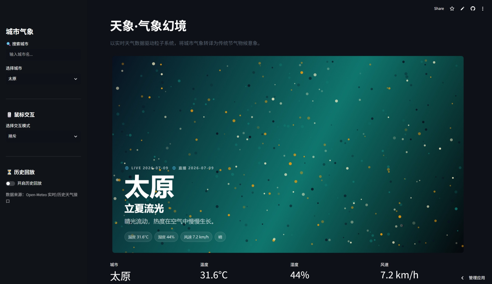
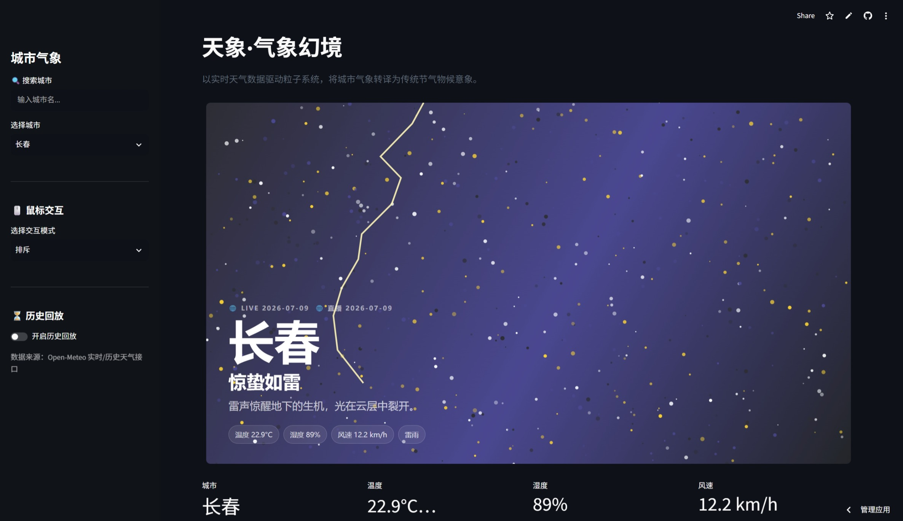
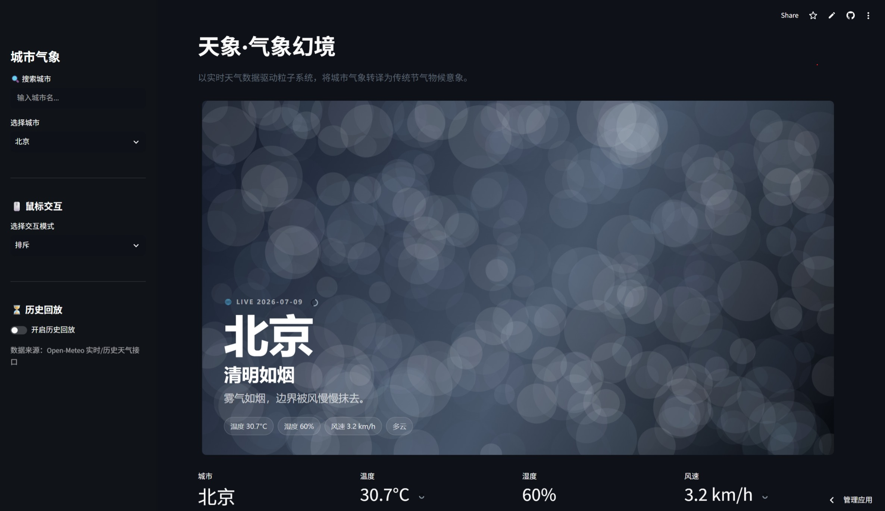

# 天象 · 气象幻境

> 基于实时天气数据驱动的节气意象可视化 —— 让城市的气象转译为可感知的传统美学。

👉 **在线体验**：[https://weather-seasonal-particles-4i5wlj4ah2zpsq39wk7xtk.streamlit.app](https://weather-seasonal-particles-4i5wlj4ah2zpsq39wk7xtk.streamlit.app)


## 📖 项目简介

《天象·气象幻境》是一个 **Streamlit** 交互式应用，通过调用 Open-Meteo 实时天气 API，将城市当前气象数据（温度、湿度、风速、天气类型）转译为动态粒子系统，并自动映射为传统二十四节气意象。

**核心转译逻辑**：

| 天气类型 | 节气意象 | 视觉风格 |
| :--- | :--- | :--- |
| 晴 | 立夏流光 | 暖色粒子，缓慢浮动 |
| 雨 | 雨水如墨 | 冷色雨丝，斜向飘落 |
| 雪 | 霜降如雪 | 白色大粒子，轻盈飘落 |
| 雷暴 | 惊蛰如雷 | 闪烁粒子 + 闪电特效 |
| 雾 / 阴 | 清明如烟 | 大粒子弥散，朦胧流动 |

每个城市、每种天气，都会生成独一无二的“节气表情”。用户可以通过侧边栏切换城市，或开启历史回放，查看过去某一天的天气对应的节气意象。


## ✨ 核心功能

### 实时天气驱动
- 🌡️ **温度** → 粒子大小
- 💧 **湿度** → 粒子密度
- 💨 **风速** → 粒子运动速度与方向
- ⛅ **天气代码** → 节气意象（晴/雨/雪/雷暴/雾）

### 交互与体验
- 🖱️ **四种鼠标交互模式**：排斥 / 吸引 / 漩涡 / 爆炸
- 🌀 **点击涟漪**：点击画布产生扩散光波
- ⏳ **历史回放**：选择过去任意日期，逐日播放天气演变
- 🔍 **城市搜索**：侧边栏快速定位 40+ 城市

### 视觉风格
- 🎨 **独立配色**：每种节气拥有专属色彩体系
- 🌄 **动态背景**：渐变 + 山影叠加，层次丰富
- ⚡ **天气特效**：雷暴闪电、雨丝拖尾、雪花飘落


## 🛠️ 技术栈

| 类别 | 技术 |
| :--- | :--- |
| **框架** | Streamlit |
| **数据源** | Open-Meteo API（无需 API Key） |
| **前端渲染** | HTML5 Canvas（粒子系统） |
| **数据处理** | Python 3.9+ / Requests |
| **历史数据** | Open-Meteo Archive API |


## 🚀 快速开始

### 1. 克隆仓库

```bash
git clone https://github.com/Drime-A202/weather-seasonal-particles.git
cd weather-seasonal-particles
```

### 2. 创建虚拟环境（推荐）

```bash
# macOS / Linux
python -m venv venv
source venv/bin/activate

# Windows
python -m venv venv
venv\Scripts\activate
```

### 3. 安装依赖

```bash
pip install -r requirements.txt
```

### 4. 启动应用

```bash
streamlit run app.py
```

### 5. 访问

浏览器打开 `http://localhost:8501`


## 🎮 使用指南

### 切换城市
- 在左侧边栏下拉菜单中选择城市
- 或使用搜索框快速定位
- 切换后粒子动画自动更新

### 交互模式
| 模式 | 效果 |
| :--- | :--- |
| **排斥** | 鼠标经过，粒子向外推开 |
| **吸引** | 粒子被鼠标吸引聚集 |
| **漩涡** | 粒子围绕鼠标旋转 |
| **爆炸** | 点击画布，粒子向外飞散 |

### 历史回放
1. 侧边栏开启“历史回放”
2. 选择过去任意日期
3. 点击“播放”，画面逐日变化
4. 速度控制可调节播放节奏


## 📊 数据与城市

- **数据来源**：Open-Meteo 实时天气 API（免费，无需 Key）
- **刷新策略**：切换城市时自动获取最新数据
- **历史数据**：Open-Meteo Archive API（支持 1940 年至今）

### 当前支持城市（40+）

| 地区 | 城市 |
| :--- | :--- |
| 直辖市 | 北京、上海、天津、重庆 |
| 东北 | 哈尔滨、长春、沈阳、大连 |
| 华北 | 呼和浩特、太原、石家庄、济南、青岛 |
| 西北 | 乌鲁木齐、拉萨、西宁、兰州、银川、敦煌 |
| 华东 | 南京、杭州、合肥、南昌、福州、台北、厦门、宁波、温州、苏州、无锡 |
| 华中 | 郑州、武汉、长沙 |
| 华南 | 广州、深圳、南宁、海口、三亚、香港、澳门、佛山、东莞、珠海、桂林 |
| 西南 | 成都、贵阳、昆明、大理、丽江 |
| 特色 | 张家界、黄山 |


## 📁 项目结构

```
weather-seasonal-particles/
├── app.py                  # Streamlit 主程序
├── requirements.txt        # Python 依赖
├── LICENSE                 # MIT 许可证
├── README.md               # 项目说明
├── .gitignore              # Git 忽略文件
├── .env.example            # 环境变量示例
├── CNAME                   # 自定义域名
├── .github/
│   └── workflows/
│       └── test.yml        # CI 测试
├── docs/                   # 文档目录
│   ├── AI_COLLABORATION.md # AI 辅助开发说明
│   ├── DEVELOPMENT_LOG.md  # 开发过程记录
│   └── FUTURE_POTENTIAL.md # 未来投稿潜力说明
└── screenshots/            # 截图目录
    ├── beijing-sunny.png
    ├── guangzhou-thunder.png
    └── haerbin-snow.png
```


## 📸 效果展示

|  晴（立夏流光） | 雷雨（惊蛰如雷） | 多云（清明如烟） |
| :---: | :---: | :---: |
|  |  |  |

> 注：请将实际截图放入 `screenshots/` 目录，并命名为对应文件名。


## 🤖 AI 辅助开发

本项目在开发过程中借助了 AI 工具进行辅助编程与调试，详见 [AI 协作说明](docs/AI_COLLABORATION.md)。


## 📝 开发过程

项目从概念到完成的全过程记录，详见 [开发日志](docs/DEVELOPMENT_LOG.md)。


## 🔮 未来展望

关于项目继续发展的可能性分析，详见 [未来投稿潜力说明](docs/FUTURE_POTENTIAL.md)。


## 📄 许可

本项目采用 MIT 许可证，详见 [LICENSE](LICENSE) 文件。


## 🙏 致谢

- [Open-Meteo](https://open-meteo.com/) 提供免费天气 API
- [Streamlit](https://streamlit.io/) 提供应用框架与云部署


⭐ 如果这个项目对你有帮助，欢迎 Star 支持！
